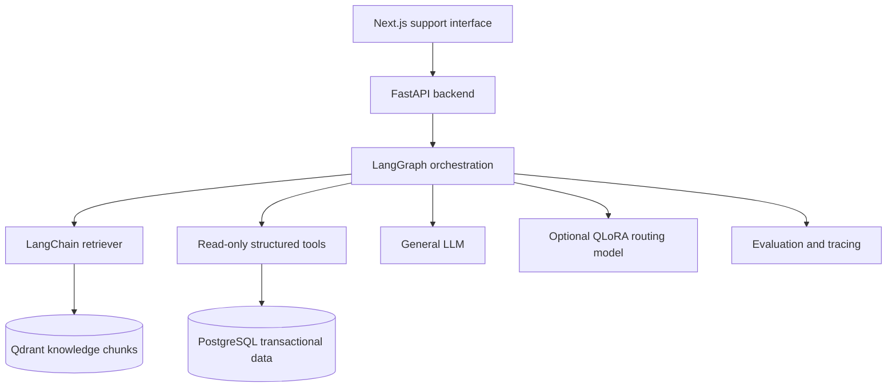
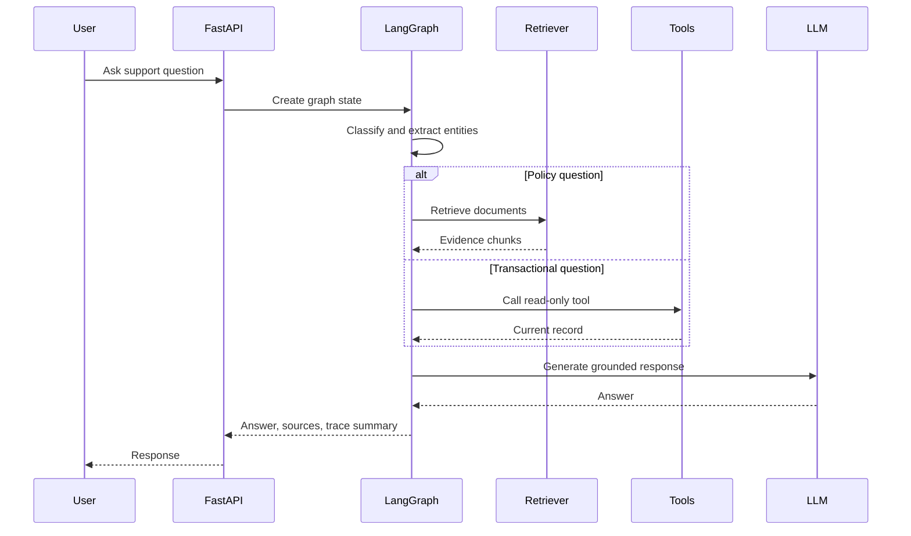
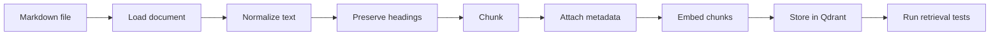
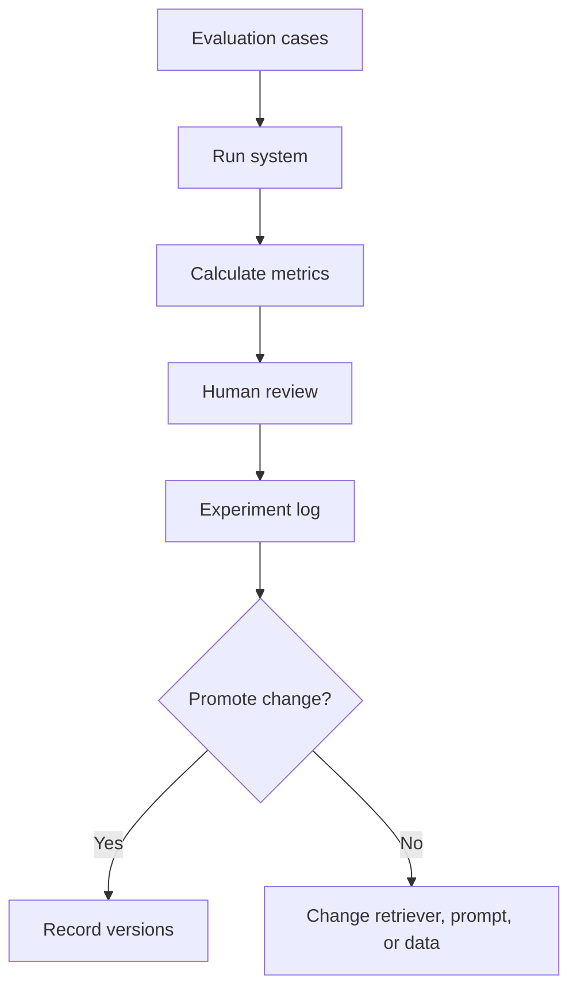
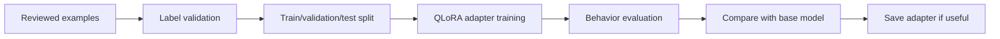

# Target Architecture

> Practice assumptions created for this learning project. These are not final business policies or legal terms.

```text
Next.js support interface
          |
FastAPI backend
          |
LangGraph orchestration
          |
LangChain retrieval and tools
          |
Qdrant + PostgreSQL
          |
General LLM + QLoRA routing model
```

## Components

- Next.js support interface: Future web UI for chat, source display, and support-agent review.
- FastAPI backend: Future API layer for chat, documents, evaluations, health, and escalations.
- LangGraph orchestration: Future state machine that decides whether to retrieve, call a tool, ask for more information, or escalate.
- LangChain retrieval and tools: Future integrations for document retrieval, prompt templates, structured outputs, and tool wrappers.
- Qdrant: Future vector database for knowledge chunks.
- PostgreSQL: Future transactional database for bookings, payments, notifications, tickets, conversations, and audit records.
- General LLM: Main model for natural-language answering.
- QLoRA routing model: Optional fine-tuned adapter for classification, extraction, routing, and formatting.

## Overall Architecture



## Support-Question Lifecycle



## Document-Ingestion Lifecycle



## Evaluation Lifecycle



## Fine-Tuning Lifecycle



## Key Differences

- Offline indexing: Loading, chunking, embedding, and storing documents before user questions arrive.
- Online retrieval: Searching Qdrant at question time.
- Online generation: Creating the answer from current user input and evidence.
- Tool execution: Reading current transactional records from databases or APIs.
- Model training: Updating adapter weights from reviewed behavior examples.

