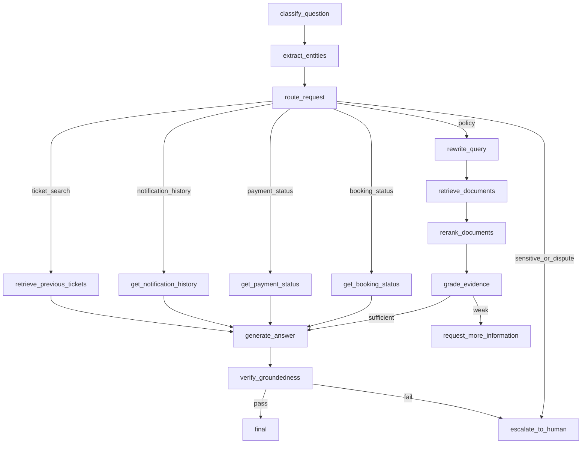

# LangGraph Design

This file designs the future workflow. It is not an implementation.

## Proposed Nodes

- `classify_question`
- `extract_entities`
- `route_request`
- `rewrite_query`
- `retrieve_documents`
- `retrieve_previous_tickets`
- `get_booking_status`
- `get_payment_status`
- `get_notification_history`
- `rerank_documents`
- `grade_evidence`
- `generate_answer`
- `verify_groundedness`
- `request_more_information`
- `escalate_to_human`

## Illustrative State Schema

```json
{
  "conversation_id": "CONV-001",
  "user_id": "USR-001",
  "question": "What is the status of booking BK-1001?",
  "intent": "booking_status",
  "entities": {
    "booking_id": "BK-1001"
  },
  "route": "get_booking_status",
  "retrieved_documents": [],
  "tool_results": [],
  "answer": null,
  "sources": [],
  "confidence": 0.0,
  "retry_count": 0,
  "needs_human": false
}
```

## Node Responsibilities

- `classify_question`: Identify broad intent.
- `extract_entities`: Extract booking IDs, payment references, dates, phone hints, and court names.
- `route_request`: Choose RAG, tool, clarification, or escalation.
- `rewrite_query`: Rewrite vague or follow-up questions for retrieval.
- `retrieve_documents`: Retrieve relevant knowledge chunks.
- `retrieve_previous_tickets`: Search prior support tickets when authorized.
- `get_booking_status`: Read current booking state.
- `get_payment_status`: Read current payment state.
- `get_notification_history`: Read current notification events.
- `rerank_documents`: Reorder candidate evidence.
- `grade_evidence`: Decide whether evidence supports an answer.
- `generate_answer`: Produce grounded response.
- `verify_groundedness`: Check answer against evidence.
- `request_more_information`: Ask for missing booking/payment details.
- `escalate_to_human`: Create handoff summary.

## Conditional Edges



## Retry Behavior

- Retry retrieval once with a rewritten query if evidence is weak.
- Retry a failed read-only tool once for transient errors.
- Do not retry unsafe or unauthorized requests.
- Maximum retries: 2 total graph recovery attempts per user turn.

## Failure Handling

If retrieval fails, explain that the system cannot find enough policy evidence. If a tool fails, do not invent transactional status. Ask the user to try again or escalate.

## Checkpointing and Persistence

Future checkpoints should save state before and after routing, retrieval, tool calls, answer generation, and escalation. Persistence enables debugging and conversation continuation.

## Conversation Memory

Memory should help interpret follow-ups, not override current policy evidence or authorization rules.

## Human Approval and Escalation

Escalate low-confidence answers, refund disputes, suspected fraud, privacy requests, cancellation exceptions, and cases where tool data contradicts user claims.

